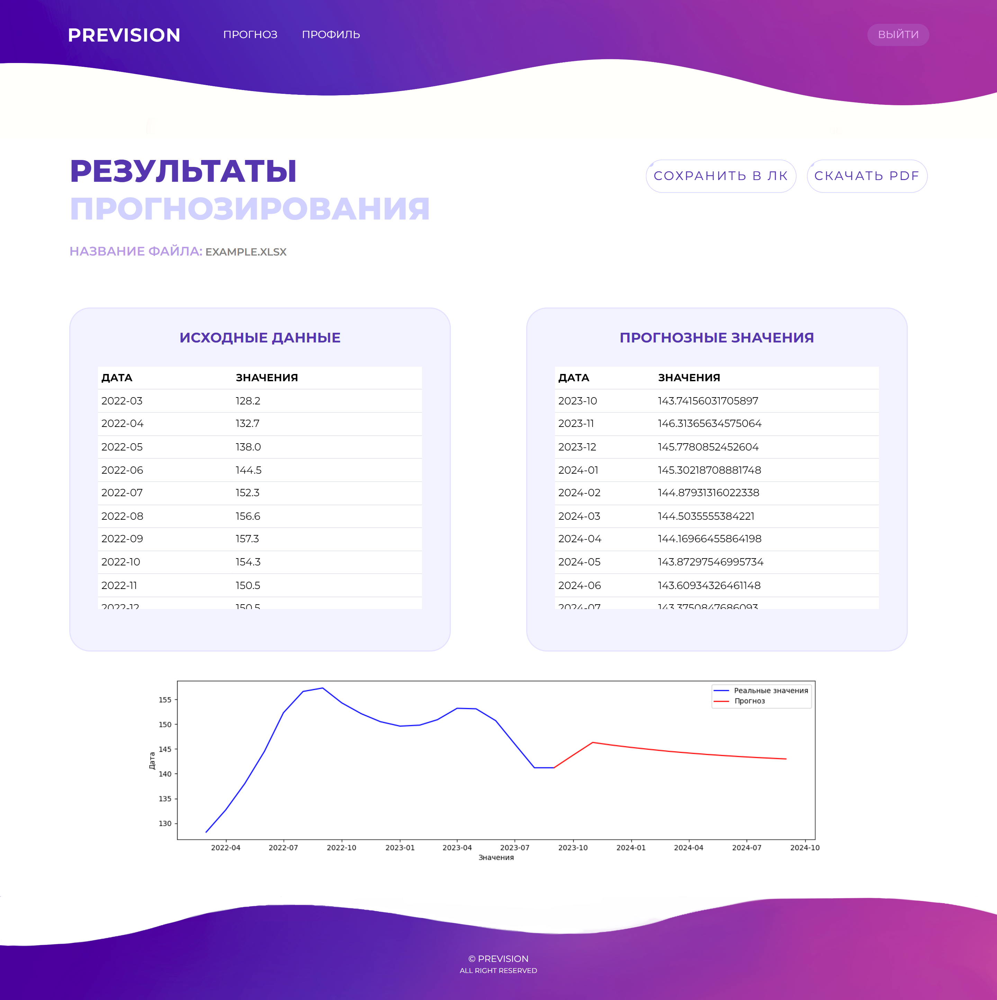

    
    <h2 align="center"><b>Prevision</b></h2>
       
  

    
A service for predicting the future value of a product
 
  

  

          <a align="center" href="https://prevision-app-react.vercel.app/">click here to see demo</a>
        
  

# 

# 🔎Introduction
This is a frontend part which based on React. You can see the whole project <a align="center" href="https://prevision-app-react.vercel.app/">here</a> .

# ✨About this project
**Prevision** is a fully responsive website that can help to automate the process of forecasting the cost of goods, which will allow entrepreneurs to assess possible risks when doing business.
- Upload data in xlsx format;
- Process, analyze and visualize data;
- Save forecasts to your personal account and download the report in PDF format.
  
It includes several pages as home, forecast, example results (results), profile, edit profile (edit), login and sign up.

## Pages
- `Home`: The landing page of the website, which displays a brief introduction and links to other pages.
- `Forecast`: A page that provides information on how to use the service, an upload form, and a link to an example results page.
- `Results`: A page containing examples of forecasts and graphs created using this service.
- `Profile`: A page displaying a user's profile with saved forecasts.
- `Edit`: A page showing the edit form, where users can change their email and username.
- `Login`: A page with a login form.
- `SignUp`: A page featuring a sign-up form.

## Website Screenshots 
### Main pages 
 
 
 
 
 ### Pages which require user authorization
 
 
  
 ### Authorization pages
 
 
